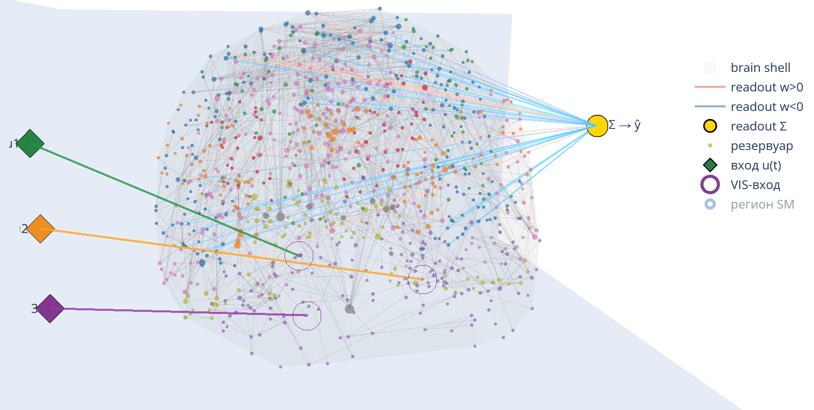

# Публичный репозиторий ВКР по теме ИССЛЕДОВАНИЕ ВОЗМОЖНОСТЕЙ РЕЗЕРВУАРНЫХ ВЫЧИСЛЕНИЙ В РЕШЕНИИ ПОСЛЕДОВАТЕЛЬНОСТИ РАЗНОТИПНЫХ ЗАДАЧ И ПОДХОДЫ К СОВЕРШЕНСТВОВАНИЮ РЕЗЕРВУАРОВ
<!-- Исследование возможностей резервуарных вычислений в решении последовательности разнотипных задач и подходы к совершенствованию резервуров.  -->

  

